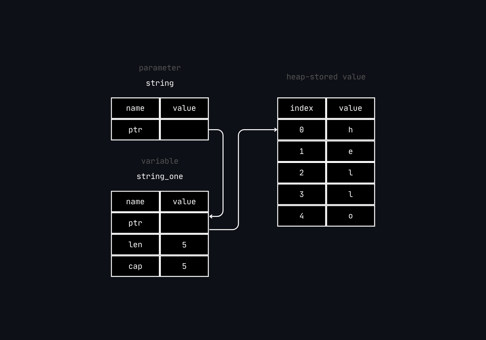

```rust
fn main() {
    let s1 = String::from("hello");

    let (s2, len) = calculate_length(s1);

    println!("The length of '{s2}' is {len}.");
}

fn calculate_length(s: String) -> (String, usize) {
    let length = s.len(); // len() returns the length of a String

    (s, length)
}
```

The issue with the tuple code is that we have to return the `String` to the calling function to still be able to use the `String`
after calling `calculate_length()`, because the `String` was moved into `calculate_length()`.

Instead, we can provide a *reference* to the `String` value. A *reference* is like a pointer in that it's an address we can
follow to access the data stored at that address; that data is owned by anothe variable. Unlike a pointer, a *reference* is
guranteed to point to a valid value of a particular type for the life of the reference :

```rust
fn main() {
    let string_one = String::from("hello");

    let len = calculate_length(&string_one);

    println!("The length of '{string_one}' is {len}.");
}

fn calculate_length(string: &String) -> usize { // The parameter type is specified to be a reference
    string.len()
}
```

What is happening right bellow using a *reference* is illustrated down bellow :



Note : The opposite of *referencing* (`&`), is called *dereferencing* (`*`).

Here is a closer analysis of the function call :

```rust
let string_one = String::from("hello");

let len = calculate_length(&string_one);
```

The `&string_one` syntax a enable to create a *reference* that *refers* to the value of
`string_one` but does not own it. Because the *reference* does not own it, the value it points
to will not be dropped when the reference stops being used.

Likewise, the signature of the function uses `&` to indicate that the type of the
parameter will be a *reference* :

```rust
fn calculate_length(string: &String) -> usize { // string is a reference to a String
    string.len()
} // Here, string goes out of scope. But because string does not have ownership of what
  // it refers to, the value is not dropped.
```

The scope in which the variable `string` is valid is the same as any function parameter’s
scope, but the value pointed to by the reference is not dropped when `string` stops being
used, because `string` doesn’t have ownership.

When functions have references as parameters instead of the actual values, we won’t need to
return the values in order to give back ownership, because we never had ownership.

We call the action of creating a *reference* ***borrowing***. As in real life, if a person
owns something, you can borrow it from them. When you’re done, you have to give it back.
You don’t own it.

What if we try to modify something that we borrowed :

```rust
// This code does not run
// It is to illustrate the concept

fn main() {
    let s = String::from("hello");

    change(&s);
}

fn change(some_string: &String) {
    some_string.push_str(", world");
}
```

Just as variables are immutable by default, so are references. We’re not allowed to
modify something we have a reference to.

---

**Mutable references**

There is a way to let us modify the borred value, using *mutable references* :

```rust
fn main() {
    let mut s = String::from("hello");

    change(&mut s);
}

fn change(some_string: &mut String) {
    some_string.push_str(", world");
}
```

First we change `s` to be mut. Then we create a mutable reference with `&mut s` where we call
the change function, and update the function signature to accept a mutable reference with
`some_string: &mut String`. This makes it very clear that the change function will mutate the
value it borrows.

Mutable references have one big restriction: if you have a mutable reference to a value,
you can have no other references to that value. This code that attempts to create two mutable
references to `s` will fail :

```rust
let mut s = String::from("hello");

    let r1 = &mut s;
    let r2 = &mut s;

    println!("{}, {}", r1, r2);
```

This error says that this code is invalid because we cannot borrow `s` as mutable more than once
at a time.

The restriction preventing multiple mutable references to the same data at the same time allows
for mutation but in a very controlled fashion. It is something that new developers struggle with
because most languages let you mutate whenever. The benefit of having this
restriction is that Rust can prevent data races at compile time. A data race is similar to
a race condition and happens when these three behaviors occur:

- Two or more pointers access the same data at the same time.
- At least one of the pointers is being used to write to the data.
- There’s no mechanism being used to synchronize access to the data.

Data races cause undefined behavior and can be difficult to diagnose and fix when you’re trying
to track them down at runtime; Rust prevents this problem by refusing to compile code with data
races.

It remains possible to use curly brackets to create a new scope, allowing for
multiple mutable references, just not simultaneous ones :

```rust
let mut s = String::from("hello");

    {
        let r1 = &mut s;
    } // r1 goes out of scope here, so we can make a new reference with no problems.

    let r2 = &mut s;
```

Rust enforces a similar rule for combining mutable and immutable references.
This code results in an error :

```rust
let mut s = String::from("hello");

let r1 = &s; // no problem
let r2 = &s; // no problem
let r3 = &mut s; // PROBLEM

println!("{}, {}, and {}", r1, r2, r3);
```

We also cannot have a *mutable reference* while we have an *immutable one* to the same value.
Users of an immutable reference don’t expect the value to suddenly change out from under them.
However, multiple immutable references are allowed because no one who is just reading the data
has the ability to affect anyone else’s reading of the data.

Note that a reference’s scope starts from where it is introduced and continues through the last
time that reference is used. For instance, this code will compile because the last usage of the
immutable references is in the `println!`, before the mutable reference is introduced :

```rust
let mut s = String::from("hello");

let r1 = &s; // no problem
let r2 = &s; // no problem
println!("{r1} and {r2}");
// variables r1 and r2 will not be used after this point

let r3 = &mut s; // no problem
println!("{r3}");
```

The scopes of the immutable references `r1` and `r2` end after the `println!` where they are last
used, which is before the mutable reference `r3` is created. These scopes don’t overlap, so
this code is allowed: the compiler can tell that the reference is no longer being used at
a point before the end of the scope.
