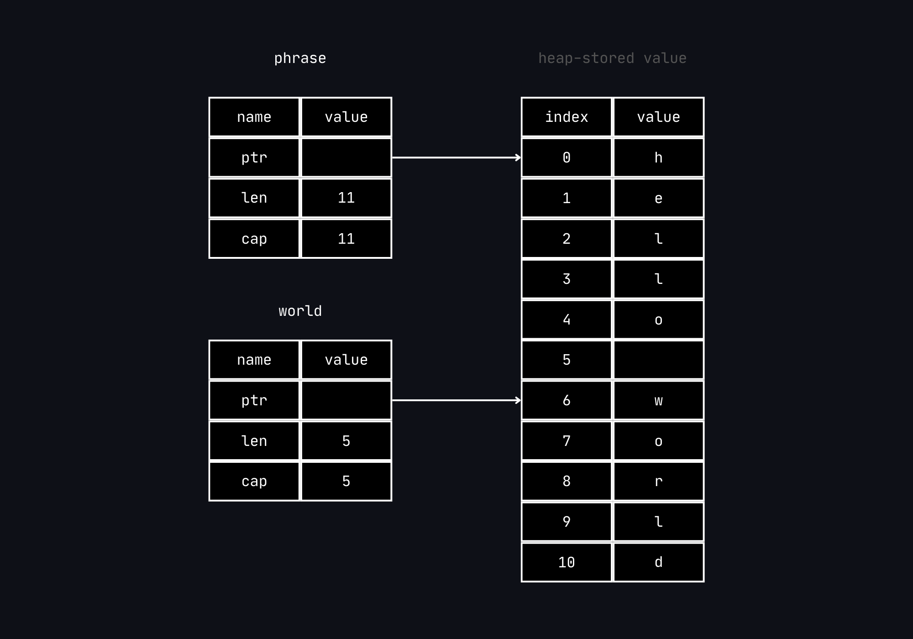

*Slices* enable referencing a contiguous sequence of elements in a *collection* rather than the whole collection.
A slice is a kind of reference, so it does not have ownership.

A *string slice* is a reference to a part of a `String`, and looks like this :

```rust
let phrase = String::from("hello world");
let hello = &phrase[0..5];
let world = &phrase[6..11];
```

Rather than a *reference* to the entire `String`, `hello` is a *reference* to a portion of the `String`,
specified in the extra `[0..5]` bit. We create slices using a range within brackets by specifying
`[starting_index..ending_index]`, where `starting_index` is the first position of the slice and `ending_index`
is one more than the last position in the slice. Internally, the slice data structure stores the starting
position and the length of the slice, which corresponds to `ending_index` minus `sarting_index`.
So, in the case of `let world = &phrase[6..11];` `world` would be a slice that contains a pointer to the byte at
index 6 of `phrase` with a length of `5`.



With Rust `..` range syntax, if it is required to start at index `0`,
the value can be dropped before the two periods (`..`), it means that
these are equal :

```rust
let word = String::from("hello");
let slice = &word[0..2];
let slice = &word[..2];
```

By the same token, ifthe slice includes the last byte of the `String`,
the trailing number can be dropped. That means these are equal :

```rust
let word = String::from("hello");
let len = word.len();

let slice = &word[3..len];
let slice = &word[3..];
```

It is also possible to drop both values to take a slice of the entire
string. So these are equal :

```rust
let word = String::from("hello");
let len = word.len();

let slice = &word[0..len];
let slice = &word[..];
```

Note : String slice range indices must occur at valid UTF-8 character
boundaries. If you attempt to create a string slice in the middle of a
multibyte character, your program will exit with an error. For the
purposes of introducing string slices, we are assuming ASCII only in
this section (chap 8 for more).

---

**String literals as slices**

```rust
let string_literal = "Hello, world";
```

The type of `string_literal` here is `&str` : it is a slice pointing to
that specific point of the binary. This is also why string literals are
immutable; `&str` is an immutable reference.


---

**String slices as parameter**

Knowing that it is possible to take slices of literals and `String` values
leads us to one more improvement on `first_word`, and that is its singature :

```rust
fn first_word(string_literal: &String) -> &str {
```

A more experienced developer would write the signature other signature :

```rust
fn first_word(string_literal: &str) -> &str {
```

That is because it allows us to use the same function on both `&String` values and `&str` values.
If we have a string slice, we can pass that directly. If we have a `String`, we can pass a slice of the `String`
or a reference to the `String`. This flexibility takes advantage of *deref coercions* (chap 15).

Defining a funciton to take a string slice instead of a reference to a `String` makes the 'API' more general
and useful without losing any functionality :

```rust
fn main() {
    let my_string = String::from("hello world");

    // `first_word` works on slices of `String`s, whether partial or whole
    let word = first_word(&my_string[0..6]);
    let word = first_word(&my_string[..]);
    // `first_word` also works on references to `String`s, which are equivalent
    // to whole slices of `String`s
    let word = first_word(&my_string);

    let my_string_literal = "hello world";

    // `first_word` works on slices of string literals, whether partial or whole
    let word = first_word(&my_string_literal[0..6]);
    let word = first_word(&my_string_literal[..]);

    // Because string literals *are* string slices already,
    // this works too, without the slice syntax!
    let word = first_word(my_string_literal);
}
```
