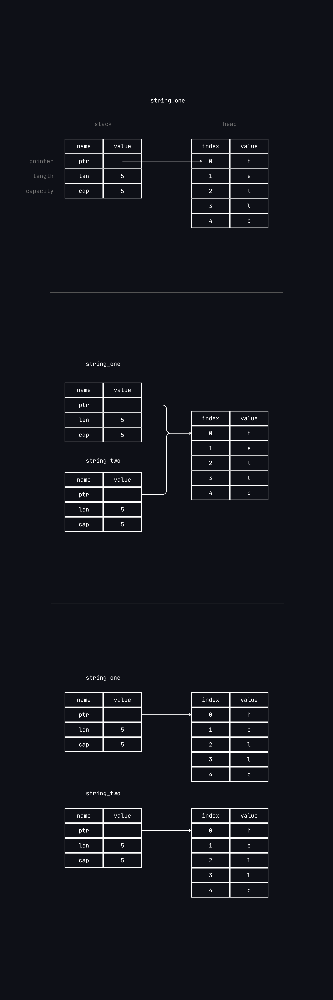

In the case of a string literal, it is hardcoded into the program, and it is
known at compile time. It is directly in the executable. This is why they are fast,
and efficient. But this properties comes from the string literal immutability.

It is not possible to put a blob of memory into the binary for each piece of text
whose size is unknown at compile time ans whose size might change while running the program.

With the `String` type, in order to support a mutable, growable piece of text,
it is required to allocate an amount of memory on the heap, unknown at compile time,
to holds content. This means :

- The memory must be requested from the memory allocator at runtime.
- We need a way of returning this memory to the allocator when we’re done with our `String`.

That first part is done by the developer: when we call `String::from`,
its implementation requests the memory it needs. This is pretty much universal
in programming languages.

However, the second part is different. In languages with garbage collector (GC),
the GC keeps track of and cleans up memory that isn't used anymore.
In most languages without GC, it is the developer responsability to identify when
memory is no longer being used and call the code to explicitly free it.
Common issues with this is that the memory hasn't been released at all, or to early,
making it missing from the program, or doing it more than once.

It is required to pair exactly one `allocate` with exactly one `free`.

Rust takes a different path : the memory is automatically returned once the variable that
owns it goes out of scope. Here is a version of a scope example :

```rust
{
        let s = String::from("hello"); // s is valid from this point forward

        // do stuff with s
}                                      // this scope is now over, and s is no
                                       // longer valid
```

There is a natural point at which we can return the memory our String needs to the
allocator: when `s` goes out of scope. When a variable goes out of scope,
Rust calls a special function. This function is called `drop`, and
it’s where the author of String can put the code to return the memory.
Rust calls drop automatically at the closing curly bracket.

This pattern has a profound impact on the way Rust code is written.
The behavior of code can be unexpected in more complicated situations
when we want to have multiple variables use the data we’ve allocated on the heap.

---

**Variable and data interacting with Move**

Multiple variables can interact with the same data in different ways in Rust :

```rust
let x = 5;
let y = x;
```

We can probably guess what this is doing: “bind the value 5 to x; then make a copy of
the value in x and bind it to y.” We now have two variables, x and y, and both equal 5.

This is indeed what is happening, because integers are simple values with a known,
fixed size, and these two 5 values are pushed onto the stack.

Now, let's take a look at the `String` version :

```rust
let string_one = String::from("hello");
let string_two = string_one;
```

This not behaves as the first example with integers.
A `String` is made up of three parts :
- A pointer to the memory that holds the content of the string
- A length (how much memory in bytes, currently used)
- A capacity (total amount of memory received from the allocator)



When assigning `string_one` to `string_two`, the string data is copied,
meaning we copy the pointer, the lenght and the capacity that are on the stack.
We do not copy the data on the heap that the pointer refers to (second schema case).

The representation does *not* look like (last schema case), which is what memory
would look like if Rust instead copied the heap data as well. If Rust did this,
the operation `s2 = s1` could be very expensive in terms of runtime performance
if the data on the heap were large.

As earlier, when a variable goes out of scope, Rust calls the `drop` function
and cleans up the heap memory for that variable. But the second schema shown that
both pointers looks for the same location, and this is the problem :

When `string_two` and `string_one` go out of scope, they will both try to free the same
memory, this is known as a *double free* error and is one of the memory safety bugs
mentionned earlier. Freeing the memory twice leads to memory corruption, which can
leads to security vulnerabilities.

To ensure memory safety, after the line `let string_two = string_one`, Rust considers
`string_one` as no longer valid. Therefor, Rust doesn't need to free anything when
`string_one` goes out of scope. For example, in this code :

```rust
let s1 = String::from("hello");
let s2 = s1;

println!("{s1}, world!");
```

Rust prevents from using the invalidated reference :

```bash
$ cargo run
   Compiling ownership v0.1.0 (file:///projects/ownership)
error[E0382]: borrow of moved value: `s1`
 --> src/main.rs:5:15
  |
2 |     let s1 = String::from("hello");
  |         -- move occurs because `s1` has type `String`, which does not implement the `Copy` trait
3 |     let s2 = s1;
  |              -- value moved here
4 |
5 |     println!("{s1}, world!");
  |               ^^^^ value borrowed here after move
  |
  = note: this error originates in the macro `$crate::format_args_nl` which comes from the expansion of the macro `println` (in Nightly builds, run with -Z macro-backtrace for more info)
help: consider cloning the value if the performance cost is acceptable
  |
3 |     let s2 = s1.clone();
  |                ++++++++

For more information about this error, try `rustc --explain E0382`.
error: could not compile `ownership` (bin "ownership") due to 1 previous error
```

It may seems like a *copy* at first, to create `string_two` from `string_one`, but
because the one that has been used to create the other one is invalidated by Rust,
it is called a *move*.

This solves the problem of risking of freeing twice the same memory location, and
by the way creating bugs and security issues. In addition, there is a design choice
that is implied by this : Rust will never automatically create “deep” copies of some
data. Therefore, any *automatic* copying can be assumed to be inexpensive in terms of
runtime performance.

---

**Scope and assignement**

The inverse of this is true for the relationship between scoping, ownership, and memory
being freed via the drop function as well. When you assign a completely new value to an
existing variable, Rust will call drop and free the original value’s memory immediately.
Consider this code, for example:

```rust
let mut string = String::from("hello");
string = String::from("goodbye");

println!("{string}, world!");
```

We initially declare a variable `string` and bind it to a String with the value "hello".
Then we immediately create a new String with the value "ahoy" and assign it to `string`.
At this point, nothing is referring to the original value on the heap at all.

The original string thus immediately goes out of scope. Rust will run the drop
function on it and its memory will be freed right away. When we print the value
at the end, it will be "goodbye, world!".

---

**Variables and data interacting with clone**

If we *do* want to deeply copy the heap data of the String, not just the stack data,
we can use a common method called `.clone()` :

```rust
let s1 = String::from("hello");
let s2 = s1.clone();

println!("s1 = {s1}, s2 = {s2}");
```

This works just fine and explicitly produces the behavior shown in the third schema,
where the heap data does get copied. When you see a call to clone, you know that some
arbitrary code is being executed and that code may be expensive.
It’s a visual indicator that something different is going on.

---

**Stack-only data : copy**

There’s another wrinkle. This code using integers—part of which was shown and is valid :

```rust
let x = 5;
let y = x;

println!("x = {x}, y = {y}");
```

This code seems to contradict what we just learned: we don’t have a call to clone,
but `x` is still valid and wasn’t moved into `y`.

The reason is that types such as integers that have a known size at compile time
are stored entirely on the stack, so copies of the actual values are quick to make.
That means there’s no reason we would want to prevent `x` from being valid after we
create the variable `y`. In other words, there’s no difference between deep and shallow
copying here, so calling clone wouldn’t do anything different from the usual shallow
copying.

Rust *Copy* trait annotation can be placed on types that are stored on the stack,
as integers. If a type implements the *Copy* trait, variables that use it do not move,
but rather are trivialy copied, making them still valid even after assignement
to another variable.

Rust won’t let us annotate a type with *Copy* if the type, or any of its parts, has
implemented the *Drop* trait. If the type needs something special to happen when the value
goes out of scope and we add the *Copy* annotation to that type, we’ll get a compile-time
error.

So, what types implement the Copy trait? Check the documentation for the
given type to be sure, but as a general rule, any group of simple *scalar* values
can implement *Copy*, and nothing that requires allocation or is some form of resource
can implement *Copy*. Here are some of the types that implement *Copy*:

- All the integer types, such as `u32`.
- The Boolean type, bool, with values `true` and `false`.
- All the floating-point types, such as `f64`.
- The character type, `char`.
- Tuples, if they only contain types that also implement *Copy*.
  For example, (`i32`, `i32`) implements *Copy*, but (`i32`, `String`) does not.
