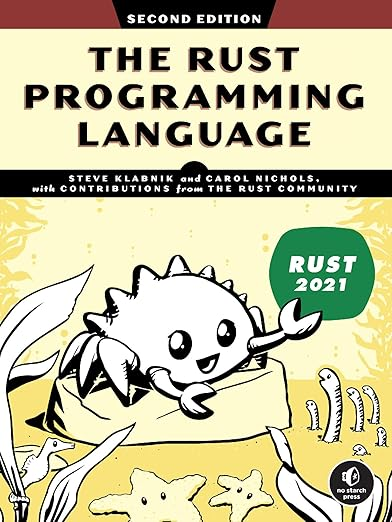

# Rust

### Overview
Rust is a modern, systems-level programming language designed for performance, safety, and concurrency. It emphasizes memory safety without requiring a garbage collector, making it a strong choice for applications where efficiency and reliability are critical.

### History
Rust was originally developed by Mozilla Research, with Graydon Hoare starting the project in 2006. It gained significant traction in 2010 when Mozilla officially sponsored it. The first stable release, Rust 1.0, was launched in 2015. Since then, Rust has grown rapidly, with consistent community-driven improvements and widespread industry adoption.

### Purpose
Rust is primarily designed for systems programming, making it a great alternative to languages like C and C++. It is used for building web assembly applications, embedded systems, operating systems, game engines, and other performance-sensitive software. Its memory safety guarantees make it particularly appealing for writing secure and concurrent applications.

 

## Key Features

### Syntax
Rust's syntax is similar to C and C++, but with additional safety features. It includes pattern matching, generics, and a powerful macro system. The ownership model is a fundamental part of Rust’s syntax, ensuring memory safety without requiring garbage collection.

### Paradigms
Rust supports multiple programming paradigms:
- **Procedural programming**: Writing structured and modular code.
- **Functional programming**: First-class functions, immutability, and iterators.
- **Object-oriented programming**: Traits and structs enable modular and reusable code.

### Type System
- **Statically typed**: Type checking occurs at compile-time, preventing many runtime errors.
- **Strongly typed**: Prevents implicit type conversions that could lead to unintended behavior.

### Memory Management
- **Ownership and Borrowing**: Rust’s unique ownership system ensures memory safety and eliminates data races.
- **No garbage collector**: Unlike languages like Java or Go, Rust does not rely on garbage collection, reducing runtime overhead.
- **Automatic memory deallocation**: The compiler ensures memory is freed when it is no longer needed, using a deterministic approach.

### Concurrency
Rust provides built-in support for concurrent programming using:
- **Threads**: Safe multithreading without data races.
- **Async/Await**: Efficient asynchronous programming for high-performance applications.
- **Message Passing**: Channels for safe inter-thread communication.

 

## Community and Ecosystem

### Popular Frameworks
- **Rocket & Actix Web**: Web frameworks for building fast and secure applications.
- **Tokio**: Asynchronous runtime for building concurrent applications.
- **Serde**: Serialization/deserialization framework.
- **Diesel & SeaORM**: ORM frameworks for database interactions.

### Community Support
- **Forums**: Rust Users Forum (users.rust-lang.org)
- **Mailing Lists**: Rust Internals and Rust Announcements
- **Conferences**: RustConf, Rust Belt Rust, EuroRust
- **GitHub & Discord**: Strong developer engagement and support channels.

 

## Real-World Applications

### Use Cases
- **Operating Systems**: Redox OS, a Rust-based operating system.
- **Web Development**: WebAssembly applications and backend services using Rust.
- **Embedded Systems**: IoT devices and real-time systems.
- **Game Development**: Game engines like Bevy and Amethyst.
- **Cryptography & Blockchain**: Used in projects like Solana and Parity Ethereum.

### Success Stories
- **Mozilla**: Rust was originally developed for improving the Firefox browser.
- **Dropbox**: Uses Rust for performance-critical parts of its infrastructure.
- **Cloudflare**: Uses Rust for secure networking applications.
- **Microsoft**: Adopting Rust for systems-level programming to enhance security.
- **Amazon Web Services (AWS)**: Uses Rust for performance-critical services like Firecracker.

Rust continues to grow in popularity, with its emphasis on safety, performance, and modern development practices making it a preferred choice for various high-performance applications.

 

## Used ressources
**The Rust Porgramming Language - Second edition**: [Edition no starch press](https://nostarch.com/rust-programming-language-2nd-edition)

 

 

---

## Table of content

- **Getting started**
  - Installation
    - [Installing rustup on macOs](./files/getting_started/installation/install_on_macOs.md)
    - [Troubleshooting](./files/getting_started/installation/troubleshooting.md)
    - [Updating and uninstalling](./files/getting_started/installation/update_uninstall.md)
    - [Local documentation](./files/getting_started/installation/local_documentation.md)
  - Hello, Wolrd!
    - [Creating a project directory](./files/getting_started/hello_world/creating_project_directory.md)
    - [Writing a running a Rust program](./files/getting_started/hello_world/write_and_run.md)
    - [Anatomy of a Rust program](./files/getting_started/hello_world/program_anatomy.md)
    - [Compiling and running are separate steps](./files/getting_started/hello_world/compile_run.md)
  - Hello, Cargo!
    - Creating a project with Cargo
    - Building and running a Cargo project
    - Building for release
    - Cargo as convention
